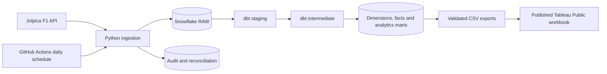

# Formula 1 Analytics Engineering Platform

An automated Formula 1 analytics platform built with Python, Snowflake, dbt, GitHub Actions, and Tableau Public. It ingests current race data, incrementally loads and models it in Snowflake, validates it with automated quality and reconciliation checks, and delivers a published Tableau Public dashboard.

## Architecture



## What is verified

| Metric | Verified result |
| --- | --- |
| Historical 2025 backfill | 1,840 RAW records across six source datasets |
| Python quality gate | 42 tests passing; Ruff clean |
| dbt quality gate | 103/103 data tests passing in a full Snowflake build |
| Daily automation | GitHub Actions at 06:00 UTC using key-pair auth, with consecutive successful scheduled runs |
| Tableau delivery | Five published dashboards: Championship Monitor, Champs Behind The Wheel, Race Analysis, Race Winners and Team Detail Analysis |

Daily ingestion, incremental dbt build and reconciliation use the scoped service user
without interactive Duo approval.

## Tableau Public delivery

The finished workbook is [F1_Analytics_Engineering_Platform.twb](dashboards/tableau/F1_Analytics_Engineering_Platform.twb). Explore the published [Tableau Public dashboard](<https://public.tableau.com/views/F1_Analytics_Engineering_Platform/ChampionshipMonitor?:language=en-US&publish=yes&:sid=&:redirect=auth&:display_count=n&:origin=viz_share_link>).

Tableau Public uses CSV extracts rather than a live private Snowflake connection. Run the export below before opening or republishing the workbook:

```powershell
uv run --frozen python scripts/export_dashboard_data.py
```

The Snowflake pipeline and marts refresh daily. Refreshing the public Tableau workbook remains a deliberate manual export-and-republish step; see [dashboard documentation](docs/dashboard.md).

## Local development

Use Git, uv and Python 3.12 from the repository root:

```powershell
uv sync --frozen
uv run --frozen python -m f1_pipeline doctor
uv run --frozen ruff check .
uv run --frozen python -m pytest
uv run --frozen python scripts/run_dbt.py parse --offline
```

Use `.venv/Scripts/python.exe` in VS Code. See [daily updates](docs/daily_updates.md) for the daily pipeline, [ingestion](docs/ingestion.md) for backfill and recovery, and [data model](docs/data_model.md) for mart grains.

## Credentials and costs

Copy `.env.example` to `.env` for local configuration. Never commit passwords, tokens, populated profiles, or private keys. GitHub Actions uses repository secrets and an `F1_PIPELINE_SVC` Snowflake service user authenticated by a key pair. The project uses the existing `COMPUTE_WH` warehouse and retains its cost controls.

## Data source

[Jolpica](https://github.com/jolpica/jolpica-f1) provides race and championship data. The ingestion client uses pagination, an identifying User-Agent, bounded retries, and a conservative request budget. Official standings remain authoritative for sprint points and subsequent corrections.

## Current scope and next enhancements

The engineering platform, daily automation, and Tableau dashboard are delivered.
The 2018–2024 historical backfill is in progress. See [architecture](docs/architecture.md)
and the [race-week refresh design](docs/race_week.md) for planned current-race updates.
Tableau refresh automation beyond the free-tier manual republish workflow and portfolio
résumé/LinkedIn material remain future enhancements.
