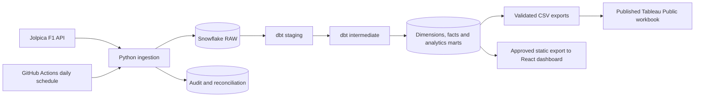

# Formula 1 Analytics Engineering Platform

An automated Formula 1 analytics platform built with Python, Snowflake, dbt, GitHub Actions, React, and Tableau Public. It ingests current race data, incrementally loads and models it in Snowflake, and validates it with automated quality and reconciliation checks. The public React dashboard is the primary polished interactive showcase; Tableau Public is its companion BI artifact.

## Architecture



## What is verified

| Metric | Verified result |
| --- | --- |
| Historical 2018–2024 backfill | 11,050 RAW records with 11,050 distinct dataset/business keys across six source datasets |
| Historical 2025 backfill | 1,840 RAW records across six source datasets |
| Python quality gate | 47 tests passing; Ruff clean |
| dbt quality gate | 104/104 data tests passing in a full Snowflake build |
| Daily automation | GitHub Actions at 06:00 UTC using key-pair auth, with consecutive successful scheduled runs |
| Race-week automation | Separate current-race workflow, scheduled twice hourly Friday–Sunday UTC and manually dispatchable |
| Companion BI delivery | Five Tableau Public dashboards: Championship Monitor, Champs Behind The Wheel, Race Analysis, Race Winners and Team Detail Analysis |
| Primary dashboard delivery | Public React Championship Monitor on GitHub Pages, regenerated after successful daily or race-week runs |

Daily ingestion, incremental dbt build and reconciliation use the scoped service user
without interactive Duo approval.

## Dashboard delivery

### React: primary showcase

The [React Championship Monitor](https://boseaditya1994.github.io/formula1-analytics-engineering/) in [dashboards/react](dashboards/react) is the primary
polished, interactive portfolio experience. It reads only approved static extracts
from the MARTS export; browser code never contains Snowflake credentials or connects
directly to Snowflake. The `Publish React dashboard` workflow regenerates those
extracts after successful daily or race-week runs and deploys the static site to
GitHub Pages.

Its current views cover championship overview, driver progression, driver
head-to-head, race analysis, constructor detail, circuit trends, and historical
season comparison.

### Tableau Public: published companion BI artifact

The finished workbook is [F1_Analytics_Engineering_Platform.twb](dashboards/tableau/F1_Analytics_Engineering_Platform.twb). Explore the published [Tableau Public dashboard](<https://public.tableau.com/views/F1_Analytics_Engineering_Platform/ChampionshipMonitor?:language=en-US&publish=yes&:sid=&:redirect=auth&:display_count=n&:origin=viz_share_link>).

Tableau Public uses CSV extracts rather than a live private Snowflake connection. Run the export below before opening or republishing the workbook:

```powershell
uv run --frozen python scripts/export_dashboard_data.py
```

The Snowflake pipeline and marts refresh daily. Refreshing the public Tableau workbook remains a deliberate manual export-and-republish step; see [dashboard documentation](docs/dashboard.md).

## Local development

Use Git, uv and Python 3.12 from the repository root:

```powershell
uv sync --frozen
uv run --frozen python -m f1_pipeline doctor
uv run --frozen ruff check .
uv run --frozen python -m pytest
uv run --frozen python scripts/run_dbt.py parse --offline
```

Use `.venv/Scripts/python.exe` in VS Code. See [daily updates](docs/daily_updates.md) for the daily pipeline, [ingestion](docs/ingestion.md) for backfill and recovery, and [data model](docs/data_model.md) for mart grains.

## Credentials and costs

Copy `.env.example` to `.env` for local configuration. Never commit passwords, tokens, populated profiles, or private keys. GitHub Actions uses repository secrets and an `F1_PIPELINE_SVC` Snowflake service user authenticated by a key pair. The project uses the existing `COMPUTE_WH` warehouse and retains its cost controls.

## Data source

[Jolpica](https://github.com/jolpica/jolpica-f1) provides race and championship data. The ingestion client uses pagination, an identifying User-Agent, bounded retries, and a conservative request budget. Official standings remain authoritative for sprint points and subsequent corrections.

## Current scope and next enhancements

The engineering platform, daily automation, historical 2018–2025 coverage, race-week
automation, and both public dashboard surfaces are delivered. See [architecture](docs/architecture.md)
and the [race-week refresh design](docs/race_week.md) for current-race scope and limits.
Future enhancements are deliberately limited to new analysis views, data-source expansion,
and Tableau refresh beyond its free-tier manual republish workflow.
