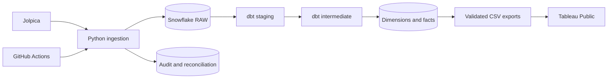

# Formula 1 Analytics Engineering Platform

Formula 1 historical ingestion and analytics with Python, Snowflake and dbt.
Daily scheduling and Tableau Public delivery are planned. See
[implementation status](docs/implementation_status.md).

## Architecture



## Local development

Use Git, uv and Python 3.12 from the repository root:

```powershell
uv sync --frozen
uv run --frozen f1-pipeline doctor
uv run --frozen ruff check .
uv run --frozen python -m pytest
uv run --frozen dbt --version
uv run --frozen python scripts/run_dbt.py parse --offline
```

Select `.venv/Scripts/python.exe` in VS Code on Windows. Invoke dbt through uv
so the project uses dbt Core instead of the global Fusion preview.
The historical loader supports schedules, race results, qualifying, sprint results,
and race-by-race driver/constructor standings. See [ingestion](docs/ingestion.md)
for authentication, backfill commands, grains, reconciliation and recovery.

## Credentials and costs

Copy `.env.example` to `.env` when configuring authentication. Never commit
passwords, tokens, private keys or populated profiles. Existing personal profiles
are preserved. The project reuses the existing `COMPUTE_WH` warehouse without altering it.
Costs depend on actual runtime and account pricing.

## Source and delivery

[Jolpica](https://github.com/jolpica/jolpica-f1) supplies race and championship
data. Ingestion uses pagination, an identifying User-Agent, bounded retries,
and a conservative request budget. Historical completeness varies by dataset.
Official standings remain authoritative, including sprint points and penalties.

The F1_ANALYTICS database, five schemas, project roles and ingestion tables are
provisioned using COMPUTE_WH. Measured load results are recorded in
[implementation status](docs/implementation_status.md).

The 2025 backfill is verified: 1,840 RAW rows across six datasets. An authenticated
dbt build passed for eight models and 49 data tests. The expanded 15-model target
parses offline, but a later Snowflake backend connection error interrupted its
live build. See [dbt execution](docs/dbt.md), [data model](docs/data_model.md), and
[current evidence and blocker](docs/implementation_status.md).

Daily scheduling, validated exports and the Tableau dashboard remain pending.
Initial Tableau Public publication refresh will be manual.
