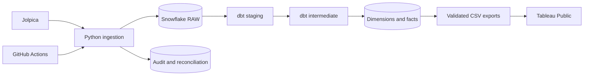

# Formula 1 Analytics Engineering Platform

Automated daily Formula 1 ingestion and analytics with Python, Snowflake, dbt,
and Tableau Public. This project is under construction; see
[implementation status](docs/implementation_status.md).

## Architecture



## Local development

Use Git, uv and Python 3.12 from the repository root:

```powershell
uv sync --frozen
uv run --frozen f1-pipeline doctor
uv run --frozen ruff check .
uv run --frozen python -m pytest
uv run --frozen dbt --version
```

Select `.venv/Scripts/python.exe` in VS Code on Windows. Invoke dbt through uv
so the project uses dbt Core instead of the global Fusion preview.
Ingestion commands and Snowflake resources are not implemented yet.

## Credentials and costs

Copy `.env.example` to `.env` when configuring authentication. Never commit
passwords, tokens, private keys or populated profiles. Existing personal profiles
are preserved. The project reuses the existing `COMPUTE_WH` warehouse without altering it.
Costs depend on actual runtime and account pricing.

## Source and delivery

[Jolpica](https://github.com/jolpica/jolpica-f1) supplies race and championship
data. Planned ingestion uses pagination, an identifying User-Agent, bounded retries,
and a conservative request budget. Historical completeness varies by dataset.
Official standings remain authoritative, including sprint points and penalties.

Snowflake marts and exports will refresh daily. Initial Tableau Public publication
refresh is manual. No completed ingestion, dashboard, cloud execution or performance
results are claimed at this stage.
