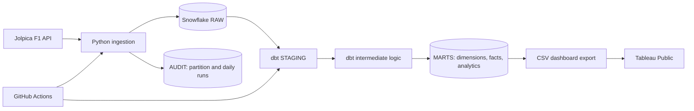

# Architecture

## Purpose

Formula 1 Analytics Engineering Platform is a batch ELT project for reliable
historical and current-season Formula 1 analytics. Its primary service level is a
daily Snowflake refresh; race-week refresh is a separate, bounded enhancement and
is not represented as live streaming.

## Data flow

1. Python requests supported Jolpica endpoints with pagination, a custom User-Agent,
   bounded retry/backoff, and source-specific partition validation.
2. Complete source partitions are merged into `F1_ANALYTICS.RAW` with canonical
   payload hashes. The audit record, reconciliation checks and MERGE commit together.
3. dbt exposes typed staging data, incremental fact tables, deterministic dimensions,
   and BI-oriented analytical marts in Snowflake.
4. dbt tests and custom reconciliations prevent an invalid mart refresh from being
   reported as successful.
5. The dashboard export reads only from MARTS with `F1_BI_READER` and creates local
   CSV extracts for Tableau Public.

## Runtime paths

| Path | Trigger | Scope | Authentication | Result |
| --- | --- | --- | --- | --- |
| Daily pipeline | GitHub Actions, 06:00 UTC | Current-season schedule, missing partitions, recent corrections | `F1_PIPELINE_SVC` key pair | Ingestion + dbt build/test |
| Historical backfill | Explicit command | Requested closed seasons and datasets | `F1_PIPELINE_SVC` key pair or approved local profile | Resumable RAW coverage |
| Race-week pipeline | Planned separate workflow | Current race only; qualifying, sprint, results and standings after source publication | `F1_PIPELINE_SVC` key pair | Bounded near-real-time refresh |
| Tableau refresh | Manual after export | Published CSV extracts | `F1_BI_READER` | Updated Tableau Public workbook |

## Security and cost controls

- The pipeline never falls back to an administrator role.
- GitHub Actions receives the Snowflake account, service user and private key only as
  repository secrets; the private key is written to an ephemeral runner file.
- `F1_INGESTOR`, `F1_TRANSFORMER` and `F1_BI_READER` separate write, transform and
  dashboard-export permissions.
- The project uses the existing `COMPUTE_WH` warehouse and avoids continuous compute.
- Tableau Public receives extracts, never a live private Snowflake credential.

## Operational boundaries

Only one writer should run at a time. The local pipeline lock prevents overlap in one
checkout; GitHub workflows must use a shared concurrency group before a second
writer-oriented workflow is enabled. A race-week workflow must not be described as
live timing: Jolpica publishes results/standings on its own schedule, and GitHub
Actions scheduling is not a real-time execution system.
