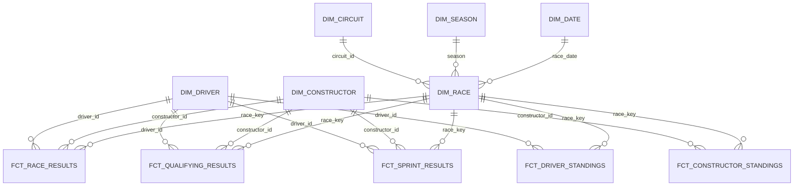

# Dimensional model

Database: F1_ANALYTICS. STAGING contains the typed current-state source view;
MARTS contains dimensions, facts and analytical tables. These are explicit schemas:
the project macro prevents dbt's default concatenation from creating STAGING_MARTS.
This schema mapping is for the single local deployment; future CI needs isolation.

## Fact contracts

| Model | Grain and unique key | Foreign keys | Measures |
| --- | --- | --- | --- |
| fct_race_results | Driver per race; result_key = season:round:driver | driver_id, constructor_id, race_key | points, finishing/grid position, laps, fastest-lap rank |
| fct_qualifying_results | Driver per qualifying session; qualifying_key = season:round:driver | driver_id, constructor_id, race_key | qualifying position, source Q1/Q2/Q3 strings |
| fct_sprint_results | Driver per sprint; sprint_key = season:round:driver | driver_id, constructor_id, race_key | sprint points, finishing/grid position |
| fct_driver_standings | Driver championship snapshot after a round; standing_key = season:round:driver | driver_id, race_key | official cumulative points, championship position, wins |
| fct_constructor_standings | Constructor championship snapshot after a round; standing_key = season:round:constructor | constructor_id, race_key | official cumulative points, championship position, wins |

The dataset is part of the RAW key; a driver can have the same season:round:driver
identifier in race results, qualifying and standings. It is never globally unique.
Natural source IDs are used rather than unexplained hashed surrogate identifiers.

## Dimensions and relationships

Driver, constructor and circuit dimensions choose the most recently observed complete
attribute row, with deterministic tie-breaking. They do not combine unrelated values
using MAX and are not SCD2 history. Race is keyed by season:round and references circuit,
date and season. The date dimension covers every day in the loaded seasons.

Driver-to-constructor membership is on race/session facts. A driver championship
snapshot can span multiple teams, so it has no single constructor foreign key.

## Analytical tables

- driver_race_performance: one row per race result with identities and race context.
  Positive positions_gained means finishing ahead of the grid position. Grid zero
  produces null movement. This is classified grid-to-result movement, not a count
  of on-track overtakes. DNF and disqualification classification are not derived yet.
- driver_championship_progression: one row per official driver snapshot with LAG
  differences in points and championship position.
- constructor_championship_progression: the corresponding constructor snapshot view.

Championship points are cumulative: never sum them across rounds. The first observed
snapshot has null change metrics. Later deltas may include penalties/corrections;
they are not assumed to equal race points alone. Sprint points stay separate from
Grand Prix points. Qualifying rank is not assumed to equal the starting grid.

The source leaves numeric driver championship position null for some snapshots and
sets positionText to '-'. Keep the numeric rank null and retain the source marker
as championship_position_text. Tests allow null ranks only with this explicit marker.
Rank movement involving an unranked snapshot is null. The 2025 load contains seven
such snapshots; they must not be discarded or assigned invented numeric ranks.

When introducing the position-text column, the driver standings model supports
`--vars '{"reprocess_history": true}'` to repopulate existing keys via MERGE without
dropping the table. Normal runs retain the updated_at filter. This is a deliberate
schema-migration run, not the default daily processing mode.

## Incremental behavior and checks

All five facts use dbt MERGE with unique keys and an inclusive RAW updated_at
watermark. An old race corrected today receives a new RAW timestamp and is eligible
for processing. dbt may update matching rows even when their values are identical;
idempotency means stable keys, row counts and contents, not zero affected-row counts.
Run scripts/verify_incremental.py to compare counts and Snowflake HASH_AGG fingerprints
before/after a normal build. Fingerprints are regression evidence, not cryptographic proof.

Tests cover keys, required casts, dimension relationships, RAW-to-fact counts,
race-mart count/points reconciliation, championship-mart points and grid movement.
Source updated_at is not used as ingestion freshness: an unchanged historical
dataset should not fail merely because its content has not changed recently.
